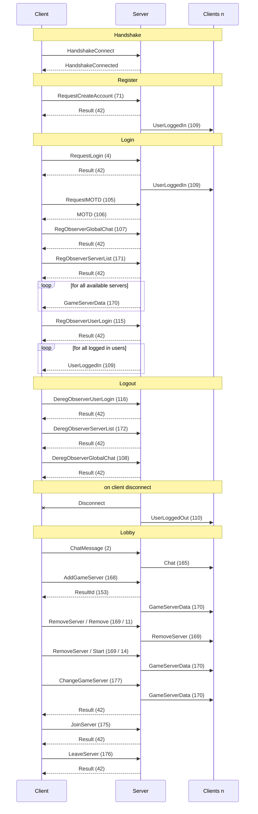

# Tincat3 protocol used by S2 DNG

## Package Flow

## Headers & IDs

magic: `EFFBBADA` \
payloadMagic: `D827` \
serverID: `CCFFFFEF`

### Header Types

2: ApplictaionMessage \
3: HandshakeConnect \
5: HandshakeConnected \
11: Ping

### Payloads

see `packages.go`
